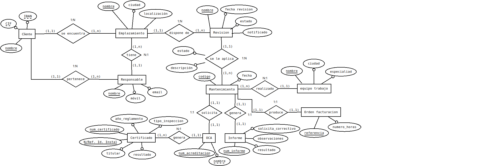

# Módulo Mantenimiento Preventivo

## Descripción corta. 

Este módulo realiza el seguimiento de los mantenimientos preventivos a los clientes, que son anuales. Pudiendo acceder a la información de los próximos mantenimientos, las órdenes de trabajo, informes y certificados del Organismo de Control Autorizado

## Descripción detallada de todas las funcionalidades a cubrir.

A través de este módulo se controla la periodicidad del mantenimiento preventivo de una instalación en un emplazamiento específico de la empresa del cliente, con una fecha estimativa (en un mes concreto). Cada cliente puede tener uno o varios *emplazamientos*. Así mismo en cada emplazamiento habrá una ubicación por *punto eléctrico*: transformadores, pararrayos, toma de tierra, cuadros eléctricos, disyuntores, etc.

La fecha de la revisión se calcula de forma automática de año en año.

Todo emplazamiento, tiene una o varias personas responsables de controlar el mantenimiento. Estas personas son trabajadores del cliente y son las personas con las que tenemos que contactar para coordinar cuándo se pueden realizar los trabajos y si se requiere que la actuación se haga en día festivo, lo cual conllevaría un gasto suplementario al tener que solicitar a la empresa suministradora, fuera de su horario normal, cortar el suministro eléctrico (un descargo) para conseguir que no llegue corriente a la empresa.

Un mes antes de la fecha de revisión, el departamento de producción realizará la **planificación** de todos los emplazamientos a realizar y se pondrán en contacto con el responsable del emplazamiento. Se podrá modificar la fecha prevista en más o menos un mes de la fecha estimada.

El emplazamiento de un cliente, puede tener diferentes *estados*: activo (está al día en documentación, pagos, cursos, etc.); inactivo (se ha dado de baja); problemas de pago; potencial (no hemos trabajado nunca en él por algo)

Cuando se va a empezar con la **coordinación del mantenimiento**, el sistema consultará los emplazamientos con el estado “activo” y "problemas de pago". En caso de que el estado sea *“problemas de pago”*, se avisará al responsable del emplazamiento para que sepa que toca el manteniendo, pero está en estado de impago. En caso de que el estado sea “activo”, se mandará un *aviso* al responsable del emplazamiento, para estipular una fecha concreta.

El departamento de producción planificará los mantenimientos, creando un **itinerario diario** para cada equipo de trabajo. El equipo de trabajo podrá consultar el itinerario de trabajo con una semana de antelación.

Una vez el equipo de trabajo haya terminado el trabajo en un emplazamiento, rellenará un informe a través de una APP. En caso de que haya ido todo bien, se **solicita la OCA** eléctrica. Si hay algún defecto, se genera un **correctivo** que pasará al departamento comercial, que generará un presupuesto, que pasará al cliente para que sea aceptado.

El resultado del **informe de la OCA** (Organismo de Control Autorizado) puede ser *positivo* y en este caso se crea un mensaje de buzón de trabajo finalizado y a partir de ahí se pueda facturar. En caso de que el informe sea *negativo*, pasa el estado del mantenimiento a cerrado, para poder facturar el trabajo realizado, pero se deberá avisar para que el departamento comercial cree un proyecto corrector y un presupuesto de la reparación.

## Mapa del módulo

Las diferentes opciones de menú que se pueden encontrar en el módulo de mantenimiento preventivo, son las siguientes:

## Dependencias con otros módulos

El módulo de mantenimiento preventivo tiene relación con los módulos:

- Empleados
- Proyectos

## Wireframes de las páginas a mostrar

Listado de próximos mantenimientos preventivos:

Creación nueva fecha de mantenimiento preventivo:

## Control de accesos

### Departamentos

Departamentos existentes en la empresa:

- Producción
- Mantenimiento preventivo
- Mantenimiento correctivo
- Comercial
- Contabilidad
- Recursos Humanos

Cada departamento tiene un responsable.

### Grupos

Habrá un grupo por departamento; otro para todos los responsables de cualquier departamento; un grupo por responsables de cada departamento.

### Permisos

Permisos sobre el módulo de mantenimiento preventivo:

|Funcionalidad|Departamento|Tipo de permiso|
| :-: | :-: | :-: |
|Consultar registros próximos mantenimientos|Producción|Insertar, Editar, Borrar, Consultar|
|Consultar orden de trabajo|Producción|Insertar, Editar, Borrar, Consultar, Imprimir|
|Consultar orden de trabajo|Responsable Mantenimiento preventivo|Consultar, Imprimir|
|Certificado OCA|Producción|Insertar, Editar, Borrar, Consultar, Imprimir|
|Informe de mantenimiento|Producción|Consultar, Imprimir|
|Informe de mantenimiento|Responsable Mantenimiento preventivo|Insertar, Editar, Borrar, Consultar, Imprimir|
|Recibir órdenes de pago|Contabilidad|Consultar|
|Obtener informes|Producción|Consultar, Imprimir|

## Diagramas de flujo funcionales de las diferentes partes del módulo. 

### Opción del menú de listado de mantenimientos preventivos

Al acceder al módulo del mantenimiento preventivo se visualizará el *listado de los próximos mantenimientos* programados.

El encargado de contactar con el responsable del emplazamiento donde se va a realizar el mantenimiento es el departamento de producción, por lo que el responsable del departamento recibirá una notificación de los mantenimientos que se deben planificar para el próximo mes, resaltando los que se van a realizar en la próxima semana.

Los registros podrán visualizarse en detalle e incluso imprimirlos.

### Opción del menú de listado de próximas Órdenes de Trabajo (OT)

Muestra las próximas órdenes de trabajo de mantenimiento preventivo:

### Opción del menú de listado de informes de Órdenes de Trabajo (OT)

Muestra el resultado de los mantenimientos preventivos realizados:

### Opción del menú de certificados de la OCA

Crearemos registros con el resultado del certificado de la OCA de cada informe de mantenimiento. Se controla si el resultado del certificado es negativo o positivo, ya que en relación a que sea negativo, se debe *cerrar* la Orden de Trabajo de una forma diferente que, si es positivo, igual que la *comunicación* a facturación. En caso de ser negativo, se debe crear un nuevo proyecto para subsanar los fallos, que deberá aprobar el cliente.

### Opción del menú de listado de órdenes de facturación

Muestra el listado de las órdenes de facturación tras cerrar una Orden de Trabajo:

## Esquema relacional de las nuevas tablas en la base de datos 

## Plantillas de comunicación

La aplicación notificará a través de correos electrónicos internos a los departamentos implicados, siguiendo la siguiente plantilla:

- Departamento origen
- Departamento destino
- Persona a la que se dirige
- Asunto
- Descripción de la comunicación
- Tarea a realizar por el departamento destino 
- Persona que debe realizar la tarea
- Espera de una respuesta (si / no)
- Confirmación de lectura (si / no)

## Referencias

- WireFramePro

    https://wireframepro.mockflow.com/
